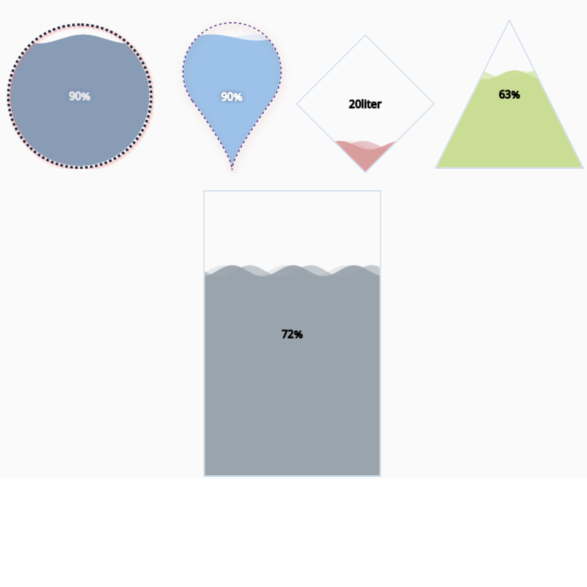

# -I4cortexComponents
A module that adds components to the Perspective module.
# Liquid-Chart

## Description

The Liquid Chart component is a versatile tool for visualizing liquid levels in tanks, providing you with the flexibility to customize various aspects of the chart.

## Properties

Here are the available properties for the Liquid Chart component:

| Property       | Type     | Default | Affects                            |
| -------------- | -------- | ------- | ---------------------------------- |
| `value`        | `number` | 0       | Value of your liquid level        |
| `max`          | `number` | 100     | Maximum level of your tank         |
| `isPercentage` | `boolean`| true    | If true, displays tank level in %  |
| `unit`         | `string` | "liter" | Appears when `isPercentage` is set to `false` |
| `formatt`      | `string` | "##"    | Format your displayed number       |
| `shape`        | `string` | "circle"| Tank shape (can be 'circle' or 'rect', etc.) |
| `outline`      | `object` | `{}`    | Customize outline style            |
| `liquid-style`| `object` | `{}`    | Customize liquid style             |
| `wave`         | `object` | `{}`    | Customize wave length and count    |
| `statistic`    | `object` | `{}`    | Customize label style              |
| `sizing`       | `object` | `{}`    | Customize chart sizing             |

## license

[MIT License](https://opensource.org/licenses/MIT)
